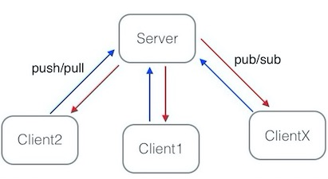

# 系统交互

## 交互模块

我们的系统现在有三大块组成：界面，Shell终端，Backend。quantdigger/demo/main.py启动后，系统会打开与之对应的三个进程。它们之间通过事件引擎来完成同步或异步的调用操作。下面详细介绍三个模块的功能。

### Backend

系统的后台程序，也是回测引擎所在的模块。它接收来自界面或者Shell的指令，并执行相应的服务请求。它的主要功能包括：加载特点交易品种数据，指标及策略。

### 界面模块

负责显示数据，比如k线，分时线等。显示指标线，策略的回测结果及买卖点等。用户通过鼠标及快捷键与界面交互，界面通过事件引擎把请求发到Backend，并显示最终的处理结果。

### Shell模块及接口

用户除了界面，还可以通过终端命令和Backend交互。目前系统支持通过ipython或者notebook做为交互终端。终端进入ipthon以后，用户可以
通过``qd``对象的``help``函数显示系统支持的所有接口。

#### get_symbol()  获取系统数据中所有的合约。
#### get_pcon() 获取系统中所有的周期合约信息。
#### get_bar(pcon)  获取指定周期合约的k线数据。
#### pcontract (str): 周期合约
#### get_algo(): 获取系统中所有的策略。
#### get_tech(): 获取系统中所有的技术指标。
#### run_algo(name)  运行某个指定的策略，并返回结果。
    
    name (str): 策略名
#### run_tech(name) 运行某个指定的技术指标，并返回结果。

    name (str): 指标名

## 事件引擎：

  事件引擎的基类是一个抽象类``EventEngine``,定义了不同实现的事件引擎必须提供的接口。其中``register``,``unregister``, ``emit``三个主要的接口函数。用户可以通过``register``和``unregister``来注册和取消对特定事件的监听回调。``emit``是抽象的事件发送接口，子类必须重载实现该函数。``Timer``是个时间事件发生器，如果需要，它会每隔一个固定的事件间隔向事件引擎发送一个“时间事件”。
  

``QueueEventEngine``是事件引擎的一个具体实现，它的事件消息存放在python自带的``Queue``结构中，因此这个事件引擎只支持多线程间的事件通信，不支持多进程和多机器通信。因为只用于单进程中，所以只需要引用同一个类实例就可以实现事件通信。
``ZMQEventEngine``是基于[ZMQ](www.zeromq.org)通信的事件引擎，因此支持多线程，多进程，多机器间的事件通信。因为每个事件引擎的客户端都必须带有数据事件缓存队列，所以它的内部引用了以``Queue``为事件缓存队列的``QueueEventEngine``实例。用户间通过多个类的实例进行事件通信，其中一个类实例即是服务端，又是客户端，负责转发事件。它的底层传输基于[ZMQ](www.zeromq.org)的pull/push及pub/sub模型。

事件引擎使用``Event``类实例作为传递的参数，底层的具体实现会把``Event``实例转化为其支持的传输格式。比如zmq传送的消息是文本：消息头 ＋ json文本。

## RPC远程调用
 系统三大模块间使用基于事件引擎的RPC来完成同步调用和异步调用。   
 
## _上一节_&nbsp;[绘图指标](paint.md)&nbsp;&nbsp;&nbsp;&nbsp;&nbsp;   _下一节_&nbsp; [界面](ui.md) &nbsp;&nbsp;&nbsp;&nbsp;&nbsp;_返回_&nbsp;[首页](wiki.md)
