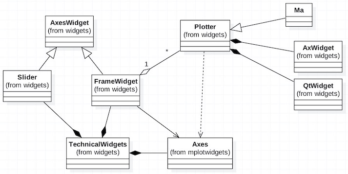

# 界面

## 当前设计

 
  

  上图是目前quantdigger典型的交易主界面图。它有两个子窗口，分别显示股票k线和对应的成交量。底部是一个蓝色按钮的滚动条。
  右下角在光标移动的时候会现实对应那根k线的数据。

  上图界面主要由三个类对象组成：一个``TechnicalWidgets``对象，2个``FrameWidget``对象和一个``Slider``对象组成。
  ``TechnicalWidgets``主窗口是``FrameWidget``窗口和``Slider``窗口的容器。滚动条被拖动的时候会让通知它的两个子窗口移动画布。

  绘图的主要操作是由``FrameWidget``窗口对象完成。一个绘图窗口由三部分组成：画布，绘图操作，交互事件的处理函数。
  matplotlib这个python包主要是用来显示一些科学数据图表。[``matplotlib.axes``](http://matplotlib.org/api/axes_api.html)可以理解为画布和窗口区域，
  提供了很多绘图函数，用于在该区域绘图。[``matplotlib.widgets.AxesWidget``](http://matplotlib.org/api/axes_api.html)本质上是一个交互事件处理类，
  用户可以自己添加对鼠标移动，按键等界面事件的处理函数。它创建的时候还接受一个``axes``画布对象，有了画布对象，``AxesWidget``就算是一个完整窗口控件。
  此外，``matplotlib.widgets``下面还有``Button``等常用的窗口控件，原理和``AxesWidget``一样，只是内置了一些默认事件的处理函数，比如按钮点击。

  ``TechnicalWidgets``是一个经典的技术指标分析界面，同时也是子窗口容器，它会根据用户创建时指定的子窗口的数目n，
  创建n个对应的画布对象。每一个画布对象传给相应的``FrameWidget``对象，形成一个窗口控件。这种窗口控件的主要作用就是用来显示一些技术图表，
  比如上图中的k线，成交量，平均线等。在系统中，而这些绘图操作则由``Plotter``的子类对象完成。
  
  
  
上图是系统的界面相关的类关系图。``Ma``是一个技术指标类，它之所以继承``Plotter``，是为了绘图方便。技术指标除了运算作用，
         很多都要求在窗口中显示运算结果，比如线条，文本，圆点等。``Plotter``定义了很多绘图函数，比如``Plotter.plot_line``, ``Plotter.plot_text``。
``Plotter``对象是``FrameWidget``对象的属性，绘图时``FrameWidget``负责调用其所拥有的所有的``Plotter``对象的绘图接口``Plotter.plot``完成
         相应的绘制。该绘图接口需要一个画布参数，``Plotter``会根据画布参数的类型来调用不同的底层绘图对象（``AxWidget``表matplotlib绘图，``QtWidget``表Qt绘图）来完成具体的绘图操作。

## 当前设计的缺点
* 指标类如果要实现绘制必须实现一个``plot``接口，这个接口直接依赖画布对象，指标和界面的耦合性太强。

## 改进方向

* 修改``Plotter``类的各绘图接口如``plot_line``的实现，它的功能应该是把绘图的数据参数存储为结构化的数据。绘图控件负责显示这些结数据。目前系统的[``StrategyContext``](https://github.com/QuantFans/quantdigger/blob/master/quantdigger/engine/context.py)`类已经实现了这个设计，它的绘图函数的功能就是结构化的存储绘图参数。[这里](https://github.com/QuantFans/quantdigger/blob/master/demo/plot_strategy.py)是实际的绘图例子。这种设计实现数据和UI的解耦，比如可以把它们以json的形式传到web端，用html5绘制。

## Plotter绘图

### 属性:

### 方法:

#### plot_text(x, y, color, size, rotation)  在坐标轴的指定位置显示文字。

    x (int): X轴坐标值。
    y (float): Y轴坐标值。
    color (str): 字体颜色。
    size (int): 字体大小
    rotation (int): 字体旋转角度。

#### plot_line(x, y, style, color, lw)  画不同风格的线。

    x (int): X轴坐标。
    y (float): Y轴坐标。
    style (str): '-': 实线；'--': 虚线；'.': 圆圈
    color (str): 颜色
    lw (int): 线宽

## _上一节_&nbsp;[系统交互](interaction.md)&nbsp;&nbsp;&nbsp;&nbsp;&nbsp;   _下一节_&nbsp; [数据结构](datastruct.md) &nbsp;&nbsp;&nbsp;&nbsp;&nbsp;_返回_&nbsp;[首页](wiki.md)